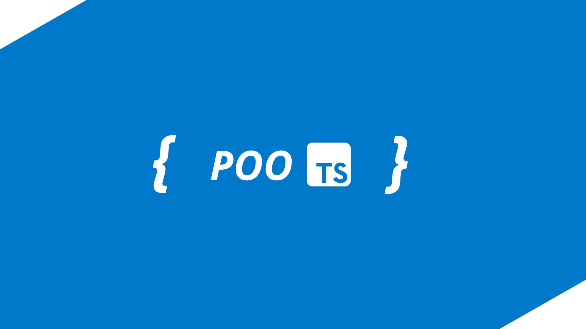

# POO em TypeScript




## Índice

- [Título e Imagem de capa](#poo-em-typescript)

- [Descrição do Projeto](#descrição-do-projeto)
- [Status do Projeto](#status-do-projeto)
- [Acesso ao Projeto](#acesso-ao-projeto)
- [Executando os arquivos TypeScript](#executando-os-arquivos-typescript)
- [Tecnologias utilizadas](#tecnologias-utilizadas)
- [Pessoas Desenvolvedoras do Projeto](#pessoas-desenvolvedoras)
- [Licença](#licença)
- [Conclusão](#conclusão)

## Descrição do Projeto

Este repositório foi criado com o objetivo de praticar os conceitos de Programação Orientada a Objetos (POO) utilizando TypeScript. Aqui, você encontrará exemplos práticos sobre os principais pilares da POO, como encapsulamento, herança, polimorfismo e abstração.
O repositório inclui uma série de exercícios e exemplos que demonstram como aplicar esses conceitos em TypeScript, ajudando a solidificar o meu entendimento e a aplicação prática da POO.

## Status do Projeto

Este projeto está atualmente em andamento. Novos exemplos e exercícios serão adicionados regularmente para cobrir mais aspectos da Programação Orientada a Objetos em TypeScript.


## Acesso ao Projeto

Você pode acessar o repositório completo no GitHub através do seguinte link: **[POO em TypeScript](https://github.com/JoelJR27/oo-em-typescript)**.

Para clonar o repositório, você pode usar o seguinte comando no seu terminal:

```bash
git clone https://github.com/JoelJR27/oo-em-typescript.git
```

Para executar o projeto localmente, siga os passos abaixo:

1. Certifique-se de ter o ***Node.js*** e o ***TypeScript*** instalados na sua máquina.
2. Navegue até o diretório do projeto clonado.
3. Instale as dependências necessárias usando:

   ```bash
   npm install
   ```

   ```bash
   yarn install
   ```

   ```bash pnpm
   pnpm install
   ```

## Executando os arquivos TypeScript

Você pode instalar a biblioteca ***`tsx` globalmente*** para facilitar a execução dos arquivos TypeScript:

```bash
npm install -g tsx
```

```bash
yarn global add tsx
```

```bash
pnpm add -g tsx
```

Depois, **você pode executar os arquivos TypeScript diretamente usando o comando**:

```bash
    tsx nome-do-arquivo.ts
```

**Caso não queira instalar**, compile os arquivos TypeScript para JavaScript usando o comando:

```bash
    tsc nome-do-arquivo.ts
```

E depois **execute o arquivo JavaScript gerado, utilizando o Node.js**:

```bash
    node nome-do-arquivo.js
```

## Tecnologias utilizadas


- [TypeScript](https://www.typescriptlang.org/): Linguagem de programação que adiciona tipagem estática ao JavaScript.
- `Paradigma POO`: Paradigma de programação que utiliza ***objetos*** para representar dados e métodos.
- [Node.js](https://nodejs.org/): Ambiente de execução JavaScript no lado do servidor.
- [Git](https://git-scm.com/): Sistema de controle de versão distribuído.
- [GitHub](https://github.com/): Plataforma de hospedagem de código-fonte e colaboração.
- [Visual Studio Code](https://code.visualstudio.com/): Editor de código-fonte.

## Pessoas Desenvolvedoras

| [<br><sub>Joel Júnior</sub>](https://github.com/JoelJR27) |
| :---------------------------------------------------------------------------------------------------------------------------: |
|                                   [LinkedIn](https://linkedin.com/in/joeljunior27/)                                    |

Sinta-se à vontade para sugerir melhorias ou abrir issues no repositório!

## Licença

Este projeto está licenciado sob a Licença MIT. Veja o arquivo [LICENSE](LICENSE) para mais detalhes.

## Conclusão

Este repositório é para mim uma excelente maneira prática de aprender e aplicar os conceitos e pilares da Orientação a Objetos, assim como demonstrar minha evolução na linguagem TypeScript. Sinta-se à vontade para explorar, contribuir e aprender junto comigo!
Agradeço por visitar este repositório e espero que ele seja útil para você também!

---
